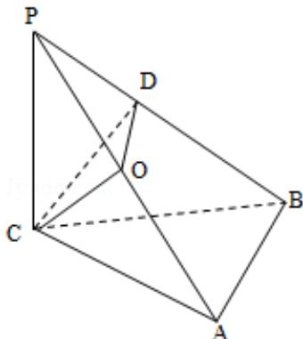

> [!faq]- 2010年重庆市高考数学试卷(文科)含答案解析
>
> > [!success]- **【答案】** 详见解析
>
> > [!note]- **【分析】**
> > （1）要证 AB⊥平面 PCB，只需证明直线 AB 垂直平面 PCB 内的两条相交直线 PC、CD 即可；
>
> > [!note]- **【解析】**
> > 分析】（1）要证 AB⊥平面 PCB，只需证明直线 AB 垂直平面 PCB 内的两条相交直线 PC、CD 即可；
> >
> > (2) 取 AP 的中点 O，连接 CO、DO；说明 $\angle COD$ 为二面角 C - PA - B 的平面角，然后解三角形求二面角 C - PA - B 的大小的余弦值.
> >
> > 【
> > 解答】（1）证明：∵PC⊥平面ABC，ABC⊂平面ABC，
> >
> > $$
> > \therefore \mathrm{PC} \perp \mathrm{AB}.
> > $$
> >
> > ∵CD⊥平面PAB，ABC平面PAB，
> >
> > ∴CD⊥AB．又PC∩CD=C，∴AB⊥平面PCB.
> >
> > (2) 解: 取 AP 的中点 O, 连接 CO、DO.
> >
> > $\because \mathrm{PC} = \mathrm{AC} = 2, \therefore \mathrm{C0} \perp \mathrm{PA}, \mathrm{CO} = \sqrt{2},$
> >
> > ∵CD⊥平面 PAB，由三垂线定理的逆定理，得 DO⊥PA.
> >
> > ∴∠COD为二面角C-PA-B的平面角.
> >
> > 由（1）AB⊥平面PCB，∴AB⊥BC，
> >
> > 又∵AB=BC，AC=2，求得 $BC=\sqrt{2}$
> >
> > $\mathrm{PB} = \sqrt{6}, \mathrm{CD} = \frac{2\sqrt{3}}{3}$
> >
> > $$
> > \therefore \sin \angle C O D = \frac {C D}{C O} = \frac {\sqrt {6}}{3}
> > $$
> >
> > $$
> > \cos \angle \mathrm{COD} = \frac {\sqrt {3}}{3}.
> > $$
> >
> > 
> >
> > 【点评】本题考查直线与平面垂直的判定,二面角的求法,考查空间想象能力,逻辑思维能力,是中档题.
