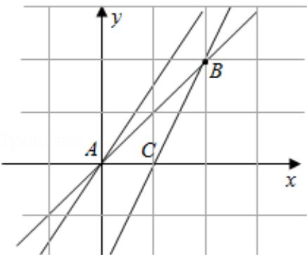

> [!faq]- 2010年重庆市高考数学试卷(文科)含答案解析
>
> > [!success]- **【答案】** C
>
> > [!note]- **【分析】**
> > 先根据约束条件画出可行域，再利用几何意义求最值， $z=3x-2y$ 表示直线在 y 轴上的截距，只需求出可行域直线在 y 轴上的截距最大值即可.
>
> > [!note]- **【解析】**
> > 解：不等式组表示的平面区域如图所示，
> >
> > 当直线 z=3x-2y 过点 D 时，在 y 轴上截距最小，z 最大
> >
> > 由 D $(0, -2)$ 知 $z_{max}=4$ .
> >
> > 故选C.
> >
> > 
> >
> > 【点评】本题主要考查了简单的线性规划，以及利用几何意义求最值，属于基础题.
