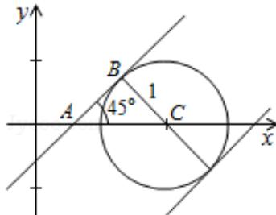

> [!faq]- 2010年重庆市高考数学试卷(文科)含答案解析
>
> > [!success]- **【答案】** D
>
> > [!note]- **【分析】**
> > 由题意将参数方程化为普通方程，因为直线与圆有两个不同的交点，可得 $\frac{|2 - b|}{\sqrt{2}} < 1$ ，从而求出 $b$ 的范围；
>
> > [!note]- **【解析】**
> > 解： $\left\{ \begin{array}{l} x = 2 + \cos \theta \\ y = \sin \theta \end{array} \right.$ 化为普通方程 $(x - 2)^2 + y^2 = 1$ ，表示圆，因为直线与圆有两个不同的交点，所以 $\frac{|2 - b|}{\sqrt{2}} < 1$ 解得 $2 - \sqrt{2} < b < 2 + \sqrt{2}$ 法2：利用数形结合进行分析得 $|AC| = 2 - b = \sqrt{2}, \therefore b = 2 - \sqrt{2}$ 同理分析，可知 $2 - \sqrt{2} < b < 2 + \sqrt{2}$ .
> >
> > 故选D.
> >
> > 
> >
> > 【点评】此题考查参数方程与普通方程的区别和联系，两者要会互相转化，根据实际情况选择不同的方程进行求解，这也是每年高考必考的热点问题。
