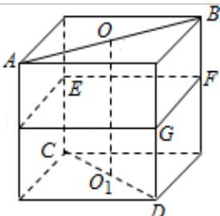

> [!faq]- 2010年重庆市高考数学试卷(文科)含答案解析
>
> > [!success]- **【答案】** D
>
> > [!note]- **【分析】**
> > 本题考查的知识点是空间中点到直线的距离，要判断到两互相垂直的异面直线的距离相等的点的个数，我们可以借助熟悉的正方体模型，在正方体中找到两条异面直线，然后进行
>
> > [!note]- **【解析】**
> > 分析】本题考查的知识点是空间中点到直线的距离，要判断到两互相垂直的异面直线的距离相等的点的个数，我们可以借助熟悉的正方体模型，在正方体中找到两条异面直线，然后进行
> > 分析，可用排除法得到
> > 答案.
> > 【
> > 解答】解：放在正方体中研究，显然，线段 $OO_{1}$ 、EF、FG、GH、HE 的中点到两垂直异面直线 AB、CD 的距离都相等，
> > 同时亦可在四条侧棱上找到四个点到两垂直异面直线 AB、CD 的距离相等。
> > 所以排除 A、B、C,
> >
> > 故选D.
> >
> > 
> >
> > 【点评】判断线与线、线与面、面与面之间的关系，可将线线、线面、面面平行（垂直）的性质互相转换，进行证明，也可将题目的中直线放在空间正方体内进行
> > 分析.
