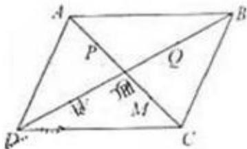

<!-- question-source:start -->
17、（2010·浙江）在平行四边形 ABCD 中，O 是 AC 与 BD 的交点，P、Q、M、N 分别是线段 OA、OB、OC、OD 的中点，在 APMC 中任取一点记为 E，在 B、Q、N、D 中任取一点记为 F，设 G 为满足向量 $\overrightarrow{OG} = \overrightarrow{OE} + \overrightarrow{OF}$ 的点，则在上述的点 G 组成的集合中的点，落在平行四边形 ABCD 外（不含边界）的概率为 \_\_\_\_。

##
三、解答题（共5小题，满分72分）
<!-- question-source:end -->

![[高中/真题/按年份分类/2010/2010年高考浙江文科数学试题及答案_精校版_/填空题/题目/answers/Q00027982A1.md]]
