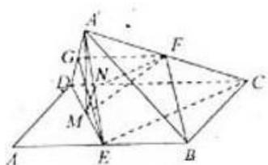

> [!faq]- 2010年高考浙江文科数学试题及答案(精校版)解析
>
> > [!success]- **【答案】** 详见解析
>
> > [!note]- **【分析】**
> > （Ⅰ）欲证 BF∥平面 A'DE，只需在平面 A'DE 中找到一条线平行于 BF 即可；而取 A'D 的中点 G，并连接 GF、GE，易证四边形 BEGF 为平行四边形，则 BF∥EG，即问题得证.
>
> > [!note]- **【解析】**
> > （Ⅰ）证明：取 A'D 的中点 G，
> >
> > 连接 GF，GE，由条件易知
> >
> > $FG\|CD,\ FG=\frac{1}{2}CD.$
> >
> > BE∥CD，BE= $\frac{1}{2}$ CD.
> >
> > 所以 FG∥BE，FG=BE。
> >
> > 故所以 BF∥EG.
> >
> > 又 $EG \subset$ 平面 $A'DE$ , $BF \notin$ 平面 $A'DE$
> >
> > 所以 BF∥平面 A'DE.
> >
> > （II）解：在平行四边形 ABCD 中，设 BC=a，
> >
> > 则 AB=CD=2a，AD=AE=EB=a，
> >
> > 连接 A'M，CE
> >
> > 因为 $\angle ABC = 120^{\circ}$
> >
> > 在 $\triangle BCE$ 中，可得 $CE=\sqrt{3}a$ ，
> >
> > 在 $\triangle ADE$ 中，可得 DE=a，
> >
> > 在 $\triangle CDE$ 中，因为 $CD^{2}=CE^{2}+DE^{2}$ ，所以 $CE \perp DE$ ，
> >
> > 在正三角形 A'DE 中，M 为 DE 中点，所以 A'M ⊥ DE.
> >
> > 由平面 A'DE⊥平面 BCD，
> >
> > 可知 A'M⊥平面 BCD，A'M⊥CE.
> >
> > 取 A'E 的中点 N，连线 NM、NF，
> >
> > 所以 NF⊥DE，NF⊥A'M.
> >
> > 因为 DE 交 A'M 于 M，
> >
> > 所以 NF⊥平面 A'DE，
> >
> > 则 $\angle FMN$ 为直线 $FM$ 与平面 $A^{\prime}DE$ 所成的角.
> >
> > 在 Rt△FMN 中，NF= $\frac{\sqrt{3}}{2}$ a，MN= $\frac{1}{2}$ a，FM=a，
> >
> > 则 $\cos\angle FMN=\frac{1}{2}$ .
> >
> > 所以直线 FM 与平面 A'DE 所成角的余弦值为 $\frac{1}{2}$ .
> >
> > 
> >
> > 点评：本题主要考查空间线线、线面、面面位置关系及线面角等基础知识，同时考查空间想象能力和推理论证能力.
