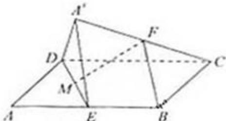

<!-- question-source:start -->
20、（2010·浙江）如图，在平行四边形ABCD中，AB=2BC， $\angle ABC=120^{\circ}$ ．E为线段AB的中点，将 $\triangle ADE$ 沿直线DE翻折成 $\triangle A^{\prime}DE$ ，使平面A^{\prime}DE⊥平面BCD，F为线段A^{\prime}C的中点.

(Ⅰ) 求证: BF‖平面 A'DE;

（II）设 M 为线段 DE 的中点，求直线 FM 与平面 A'DE 所成角的余弦值.

<!-- question-source:end -->

![[高中/真题/按年份分类/2010/2010年高考浙江文科数学试题及答案_精校版_/解答题/题目/answers/Q00023655A1.md]]
