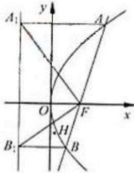

<!-- question-source:start -->
22、（2010·浙江）已知 m 是非零实数，抛物线 C: $y^{2}=2px$ （p>0）的焦点 F 在直线 $l: x - my - \frac{m^{2}}{2}=0$ 上.

(Ⅰ) 若 m=2，求抛物线 C 的方程

（II）设直线 I 与抛物线 C 交于 A、B， $\triangle AA_{2}F$ ， $\triangle BB_{1}F$ 的重心分别为 G，H，求证：对任意非零实数 m，抛物线 C 的准线与 x 轴的焦点在以线段 GH 为直径的圆外.

#
<!-- question-source:end -->

![[高中/真题/按年份分类/2010/2010年高考浙江文科数学试题及答案_精校版_/解答题/题目/answers/Q00023657A1.md]]
