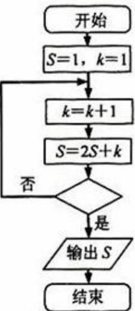

<!-- question-source:start -->
4、（2010·浙江）某程序框图如图所示，若输出的 S=57，则判断框内位（）

A、 $k>4$ B、 $k>5$ C、 $k>6$ D、 $k>7$
<!-- question-source:end -->

![[高中/真题/按年份分类/2010/2010年高考浙江文科数学试题及答案_精校版_/选择题/题目/answers/Q00023639A1.md]]
