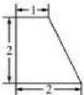
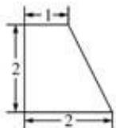
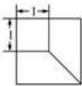

<!-- question-source:start -->
8、（2010·浙江）一个空间几何体的三视图及其尺寸如下图所示，则该空间几何体的体积是（）

  
正视图

  
侧视图

  
俯视图

A、 $\frac{7}{3}$ B、 $\frac{14}{3}$ C、7 D、14
<!-- question-source:end -->

![[高中/真题/按年份分类/2010/2010年高考浙江文科数学试题及答案_精校版_/选择题/题目/answers/Q00023643A1.md]]
