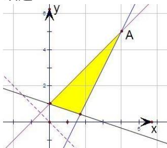

> [!faq]- 2010年高考浙江文科数学试题及答案(精校版)解析
>
> > [!success]- **【答案】** A
>
> > [!note]- **【分析】**
> > 先根据条件画出可行域，设 $z = x + y$ ，再利用几何意义求最值，将最大值转化为 $y$ 轴上的截距，只需求出直线 $z = x + y$ ，过可行域内的点 A（4，5）时的最大值，从而得到 z 最大值即可.
>
> > [!note]- **【解析】**
> > 解：先根据约束条件画出可行域，设 $z=x+y$ ，
> >
> > ∵直线 $z=x+y$ 过可行域内点 A（4，5）时
> >
> > z 最大，最大值为 9，
> >
> > 故选A.
> >
> > 
> >
> > 点评：本题主要考查了用平面区域二元一次不等式组，以及简单的转化思想和数形结合的思想，属中档题.
