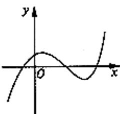
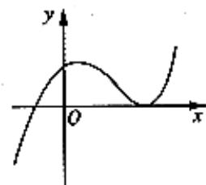
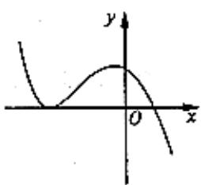
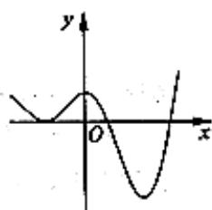

<!-- question-source:start -->
1. 已知全集 $U = R$ ，集合 $M = \left\{x \mid x^2 - 4 \leq 0\right\}$ ，则 $\tilde{\partial}_U M =$ (A) $\left\{x \mid -2 < x < 2\right\}$ (B) $\left\{x \mid -2 \leq x \leq 2\right\}$ (C) $\left\{x \mid x < -2 \text{或} x > 2\right\}$ (D) $\left\{x \mid x \leq -2 \text{或} x \geq 2\right\}$

(2) 已知 $\frac{a+2i}{i}=b+i$ $(a,b\in R)$ ，其中 i 为虚数单位，则 $a+b=$ (A) -1
(B) 1
(C) 2
(D) 3

(3) $f(x) = \log_2(3^x + 1)$ 的值域为 (A) $(0, +\infty)$ (B) $[0, +\infty)$ (C) $(1, +\infty)$ (D) $[1, +\infty)$

(4) 在空间，下列命题正确的是
(A) 平行直线的平行投影重合 (B) 平行于同一直线的两个平面

(C) 垂直于同一平面的两个平面平行 (D) 垂直于同一平面的两个平面平行 (5) 设 $f(x)$ 为定义在 $\mathbb{R}$ 上的函数。当 $x \geq 0$ 时， $f(x) = 2^x + 2x + b$ (b为常数)，则 $f(-1) =$ (A) -3 (B) -1 (C) 1 (D) 3

(7) 设 $\{a_{n}\}$ 是首项大于零的等比数列，则 “ $a_{1} \mathsf{p} a_{2}$ ” 是 “数列 $\{a_{n}\}$ 是递增数列” 的
(A) 充分而不必要条件 (B) 必要而不充分条件
(C) 充分而不必要条件 (D) 既不充分也不必要条件

(8) 已知某生产厂家的年利润 $y$ （单位：万元）与年产量 $x$ （单位：万件）的函数关系式为 $y = -\frac{1}{3} x^2 + 81x - 234$ ，则使该生产厂家获取最大年利润的年产量为
(A) 13 万件 (B) 11 万件 (C) 9 万件 (D) 7 万件

(9) 已知抛物线 $y^{2}=2px(p>0)$ ，过其焦点且斜率为1的直线交抛物线于A, B两点，若线段AB的中点的纵坐标为2，则该抛物线的标准方程为
(A) x = 1
(B) x = -1
(C) x = 2
(D) x = -2

(10) 观察 $(x^{2})' = 2x, (x^{4})' = 4x^{2}, (\cos x)' = -\sin x$ ，由归纳推理可得：若定义在 R 上的函数 $f(x)$ 满足 $f(-x) = f(x)$ ，记 $g(x)$ 为 $f(x)$ 的导函数，则 $g(-x)$ (A) $f(x)$ (B) $-f(x)$ (C) $g(x)$ (D) $-g(x)$

(11) 函数 $y = 2^{x} - x^{2}$ 的图像大致是

  
(A)

  
(B)

  
(C)

  
(D)

(12) 定义平面向量之间的一种运算 “e” 如下：对任意的 $a=(m,n)$ ， $b=(p,q)$ ，令 $a \in b = mq - mp$ . 下面说法错误的是

(A) 若 $a$ 与 $b$ 共线，则 $a \in b = 0$

(B) $a \in b = b \in a$

(C) 对任意的 $\lambda \in R,$ 有 $(\lambda a) \in b = \lambda (a \in b)$

(D) $(a \in b)^{2} + (a \cdot b)^{2} = |a|^{2} |b|^{2}$

## 第Ⅱ卷（共90分）
<!-- question-source:end -->

![[高中/真题/按年份分类/2010/2010年高考真题数学_文__山东卷__含解析版_/一_选择题/题目/answers/Q00023461A1.md]]
