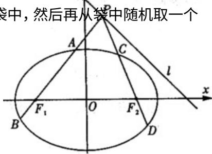

<!-- question-source:start -->
(19) (本小题满分 12 分)

一个袋中装有四个形状大小完全相同的球，球的编号分别为 $1,2,3,4$

（Ⅰ）从袋中随机取出两个球，求取出的球的编号之和不大于4的概率

（Ⅱ）先从袋中随机取一个球，该球的编号为 m，将球放回袋中，然后再从袋中随机取一个球，该球的编号为 n，求 $n < m + 2$ 的概率。

<!-- question-source:end -->

![[高中/真题/按年份分类/2010/2010年高考真题数学_文__山东卷__含解析版_/解答题/题目/answers/Q00027667A1.md]]
