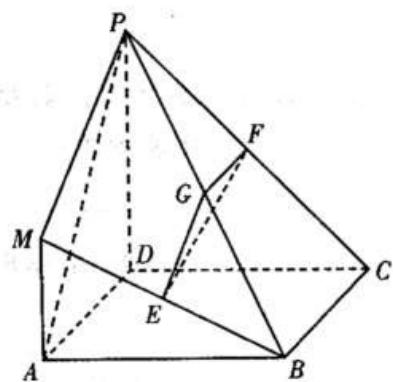

<!-- question-source:start -->
(20) (本小题满分 12 分)

在如图所示的几何体中，四边形 ABCD 是正方形， $MA \perp$ 平面 ABCD, $PD \parallel MA$ , E、G、F 分别为 MB、PB、PC

的中点，且 $\mathrm{AD} = \mathrm{PD} = 2\mathrm{MA}$ ：

（Ⅰ）求证：平面 EFG ⊥ 平面 PDC；

（Ⅱ）求三棱锥 P - MAB 与四棱锥 P - ABCD 的体积之比。

<!-- question-source:end -->

![[高中/真题/按年份分类/2010/2010年高考真题数学_文__山东卷__含解析版_/解答题/题目/answers/Q00027668A1.md]]
