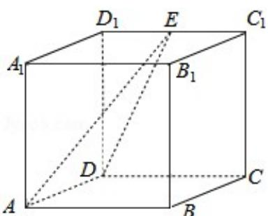

> [!faq]- 2011年全国统一高考数学试卷（文科）（大纲版）（含解析版）解析
>
> > [!success]- **【答案】** $\sqrt{3}$
>
> > [!note]- **【分析】**
> > 根据题意知 AD∥BC，∴∠DAE 就是异面直线 AE 与 BC 所成角，解三角形即
>
> > [!note]- **【解析】**
> > 解：连接 DE，设 AD=2
> >
> > 易知 AD∥BC，
> >
> > ∴∠DAE 就是异面直线 AE 与 BC 所成角，
> >
> > 在 $\triangle RtADE$ 中，由于 $DE=\sqrt{5}$ ，AD=2，可得AE=3
> >
> > $$
> > \therefore \cos \angle D A E = \frac {A D}{A E} = \sqrt {3},
> > $$
> >
> > 故答案为： $\sqrt{3}$
> >
> > 
