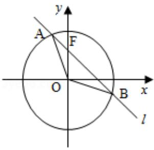

<!-- question-source:start -->
22. (12 分) 已知 O 为坐标原点, F 为椭圆 C: $x^{2} + \frac{y^{2}}{2} = 1$ 在 y 轴正半轴上的焦点, 过

F 且斜率为 $-\sqrt{2}$ 的直线 l 与 C 交于 A、B 两点，点 P 满足 $\overrightarrow{OA} + \overrightarrow{OB} + \overrightarrow{OP} = \overrightarrow{0}$ .

（Ⅰ）证明：点P在C上；

（Ⅱ）设点 P 关于点 O 的对称点为 Q，证明：A、P、B、Q 四点在同一圆上.

# 2011年全国统一高考数学试卷（文科）（大纲版）

参考
<!-- question-source:end -->

![[高中/真题/按年份分类/2011/2011年全国统一高考数学试卷_文科__大纲版__含解析版_/解答题/题目/answers/Q00025208A1.md]]
