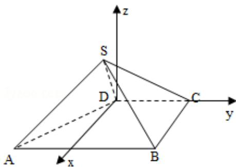

> [!faq]- 2011年全国统一高考数学试卷（文科）（大纲版）（含解析版）解析
>
> > [!success]- **【答案】** 详见解析
>
> > [!note]- **【分析】**
> > （1）利用线面垂直的判定定理，即证明 SD 垂直于面 SAB 中两条相交的直
>
> > [!note]- **【解析】**
> > （Ⅰ）证明：在直角梯形 ABCD 中，
> >
> > ∵AB∥CD，BC⊥CD，AB=BC=2，CD=1
> >
> > $\therefore \mathrm{AD} = \sqrt{\left(\mathrm{AB} - \mathrm{CD}\right)^2 + \mathrm{BC}^2} = \sqrt{5}$
> >
> > ∵侧面 SAB 为等边三角形，AB=2
> >
> > $\therefore SA=2$
> >
> > $$
> > \because S D = 1
> > $$
> >
> > $$
> > \therefore A D ^ {2} = S A ^ {2} + S D ^ {2}
> > $$
> >
> > ∴SD⊥SA
> >
> > 同理：SD⊥SB
> >
> > ∵SA∩SB=S，SA，SBC面SAB
> >
> > ∴SD⊥平面 SAB
> >
> > （Ⅱ）建立如图所示的空间坐标系
> >
> > 则 A（2，-1，0），B（2，1，0），C（0，1，0），
> >
> > 作出 S 在底面上的投影 M，则由四棱锥 S-ABCD 中， $AB\|CD, BC\perp CD$ ，侧面 SAB 为
> >
> > 等边三角形知，M 点一定在 x 轴上，又 AB=BC=2，CD=SD=1。可解得 $MD=\frac{1}{2}$ ，从
> >
> > 而解得 $SM=\frac{\sqrt{3}}{2}$ ，故可得 $S\left(\frac{1}{2},0,\frac{\sqrt{3}}{2}\right)$
> >
> > 则 $\overrightarrow{\mathrm{SB}} = (\frac{3}{2}, 1, -\frac{\sqrt{3}}{2}), \quad \overrightarrow{\mathrm{SC}} = (-\frac{1}{2}, 1, -\frac{\sqrt{3}}{2})$
> >
> > 设平面 SBC 的一个法向量为 $\vec{n}=(x,y,z)$
> >
> > 则 $\overrightarrow{\mathrm{SB}}\cdot \overrightarrow{\mathrm{n}} = 0,\overrightarrow{\mathrm{SC}}\cdot \overrightarrow{\mathrm{n}} = 0$
> >
> > 即 $\left\{ \begin{array}{l} \frac{3}{2}\mathrm{x + y - }\frac{\sqrt{3}}{2}\mathrm{z = 0}\\ -\frac{1}{2}\mathrm{x + y - }\frac{\sqrt{3}}{2}\mathrm{z = 0} \end{array} \right.$
> >
> > 取 $x = 0$ ， $\mathrm{y} = \frac{\sqrt{3}}{2}$ ， $z = 1$
> >
> > 即平面 SBC 的一个法向量为 $\vec{n}=(x,y,z)=(0,\frac{\sqrt{3}}{2},1)$
> >
> > 又 $\overrightarrow{AB} = (0, 2, 0)$
> >
> > $$
> > \cos <   \overrightarrow {A B}, \overrightarrow {n} > = \frac {\overrightarrow {A B} \cdot \overrightarrow {n}}{| \overrightarrow {A B} | \cdot | \overrightarrow {n} |} = \frac {\sqrt {3}}{\sqrt {7}} = \frac {\sqrt {2 1}}{7}
> > $$
> >
> > $$
> > \therefore <   \overrightarrow {A B}, \overrightarrow {n} > = \arccos \frac {\sqrt {2 1}}{7}
> > $$
> >
> > 即 AB 与平面 SBC 所成的角的大小为 $\arcsin\frac{\sqrt{21}}{7}$
> >
> > 
> >
> > 【点评】本题考查了直线与平面垂直的判定，直线与平面所成的角以及空间向量
> >
> > 的基本知识，属于中档题.
