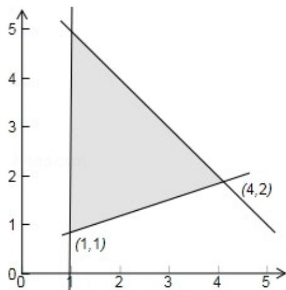

> [!faq]- 2011年全国统一高考数学试卷（文科）（大纲版）（含解析版）解析
>
> > [!success]- **【答案】** C
>
> > [!note]- **【分析】**
> > 我们先画出满足约束条件 $\left\{ \begin{array}{l} x + y < 6 \\ x - 3y \leqslant -2 \\ x \geqslant 1 \end{array} \right.$ 的平面区域, 然后求出平面区域内各个顶点的坐标, 再将各个顶点的坐标代入目标函数, 比较后即可得到目标函数的最值.
>
> > [!note]- **【解析】**
> > 解：约束条件 $\left\{\begin{aligned}x+y&<6\\ x-3y&\leqslant-2\\ x&\geqslant1\end{aligned}\right.$ 的平面区域如图所示：
> >
> > 由图可知，当 $x = 1$ ， $y = 1$ 时，目标函数 $z = 2x + 3y$ 有最小值为5
> >
> > 故选：C.
> >
> > 
> >
> > 【点评】本题考查的知识点是线性规划，其中画出满足约束条件的平面区域是解
> > 答本题的关键.
