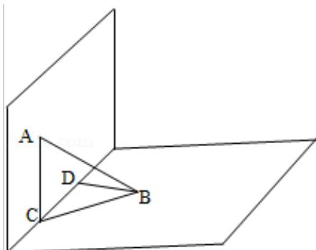

> [!faq]- 2011年全国统一高考数学试卷（文科）（大纲版）（含解析版）解析
>
> > [!success]- **【答案】** C
>
> > [!note]- **【分析】**
> > 根据线面垂直的判定与性质, 可得 AC⊥CB, △ACB 为直角三角形, 利用勾股定理可得 BC 的值; 进而在 Rt△BCD 中, 由勾股定理可得 CD 的值, 即可得答案.
>
> > [!note]- **【解析】**
> > 解：根据题意，直二面角 $\alpha - 1 - \beta$ ，点 $A \in \alpha$ ， $AC \perp I$ ，可得 $AC \perp \beta$ ，
> >
> > 则 AC⊥CB，△ACB 为 Rt△，且 AB=2，AC=1，
> >
> > 由勾股定理可得， $BC=\sqrt{3}$ ;
> >
> > 在 Rt△BCD 中，BC= $\sqrt{3}$ ，BD=1，
> >
> > 由勾股定理可得， $CD=\sqrt{2}$ ;
> >
> > 故选：C.
> >
> > 
> >
> > 【点评】本题考查两点间距离的计算, 计算时, 一般要把空间图形转化为平面图形,
> > 进而构造直角三角形，在直角三角形中，利用勾股定理计算求解.
