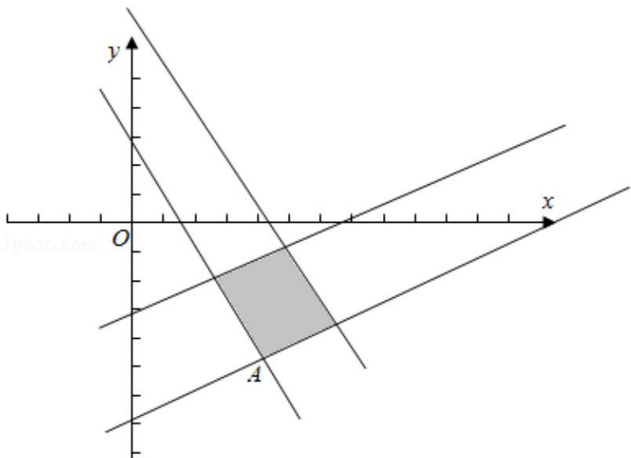

> [!faq]- 2011年全国统一高考数学试卷（文科）（新课标）（含解析版）解析
>
> > [!success]- **【答案】** -6
>
> > [!note]- **【分析】**
> > 在坐标系中画出约束条件的可行域, 得到的图形是一个平行四边形, 把目
>
> > [!note]- **【解析】**
> > 解：在坐标系中画出约束条件的可行域，
> >
> > 得到的图形是一个平行四边形，
> >
> > 目标函数 $z=x+2y$ ，
> >
> > 变化为 $y = -\frac{1}{2}x + \frac{z}{2}$ ,
> >
> > 当直线沿着 y 轴向上移动时，z 的值随着增大，
> >
> > 当直线过 A 点时，z 取到最小值，
> >
> > 由 y=x-9 与 $2x+y=3$ 的交点得到 A（4，-5）
> >
> > $$
> > \therefore z = 4 + 2 (- 5) = - 6
> > $$
> >
> > 故答案为：-6.
> >
> > 
> >
> > 【点评】本题考查线性规划问题，考查根据不等式组画出可行域，在可行域中，找
> >
> > 出满足条件的点，把点的坐标代入，求出最值.
