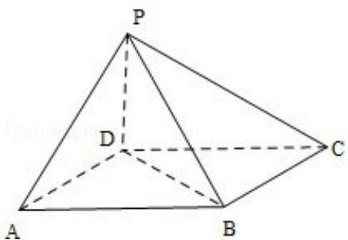

<!-- question-source:start -->
18．（12分）如图，四棱锥P-ABCD中，底面ABCD为平行四边形.∠DAB=60°，AB=2AD，PD⊥底面ABCD.

(Ⅰ) 证明: PA⊥BD

（II）设 PD=AD=1，求棱锥 D-PBC 的高.

<!-- question-source:end -->

![[高中/真题/按年份分类/2011/2011年全国统一高考数学试卷_文科__新课标__含解析版_/解答题/题目/answers/Q00024836A1.md]]
