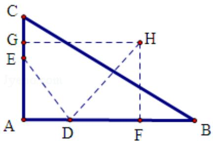

> [!faq]- 2011年全国统一高考数学试卷（文科）（新课标）（含解析版）解析
>
> > [!success]- **【答案】** (10 分) 如图, D, E 分别为 $\triangle ABC$ 的边 $AB$ , $AC$ 上的点, 且不与 $\triangle ABC$ 的顶点重
>
> > [!note]- **【分析】**
> > (I) 做出辅助线, 根据所给的 AE 的长为 m, AC 的长为 n, AD, AB 的长是关
>
> > [!note]- **【解析】**
> > 解：（I）连接 DE，根据题意在△ADE 和△ACB 中，
> >
> > $$
> > A D \times A B = m n = A E \times A C,
> > $$
> >
> > 即 $\frac{AD}{AC}=\frac{AE}{AB}$
> >
> > 又 $\angle DAE=\angle CAB$ ，从而 $\triangle ADE\sim\triangle ACB$
> >
> > 因此 $\angle ADE = \angle ACB$
> >
> > ∴C，B，D，E四点共圆.
> >
> > （Ⅱ）m=4，n=6 时，方程 $x^{2}-14x+mn=0$ 的两根为 $x_{1}=2$ ， $x_{2}=12$ 。
> >
> > 故 AD=2，AB=12。
> >
> > 取 CE 的中点 G, DB 的中点 F, 分别过 G, F 作 AC, AB 的垂线, 两垂线相交于 H 点,
> >
> > 连接 DH.
> >
> > ∵C，B，D，E四点共圆，
> >
> > ∴C，B，D，E 四点所在圆的圆心为 H，半径为 DH.
> >
> > 由于 $\angle A = 90^{\circ}$ ，故GH∥AB，HF∥AC．HF=AG=5，DF= $\frac{1}{2}$ （12-2）=5.
> >
> > 故 C, B, D, E 四点所在圆的半径为 $5\sqrt{2}$
> >
> > 
