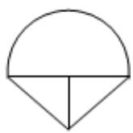
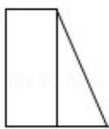
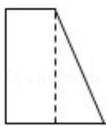
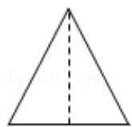
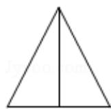

<!-- question-source:start -->
8.（5分）在一个几何体的三视图中，正视图和俯视图如图所示，则相应的侧视图

可以为（）

  
(正视图)  
(俯视图)

A.

B.

C.

D.

<!-- question-source:end -->

![[高中/真题/按年份分类/2011/2011年全国统一高考数学试卷_文科__新课标__含解析版_/选择题/题目/answers/Q00024826A1.md]]
