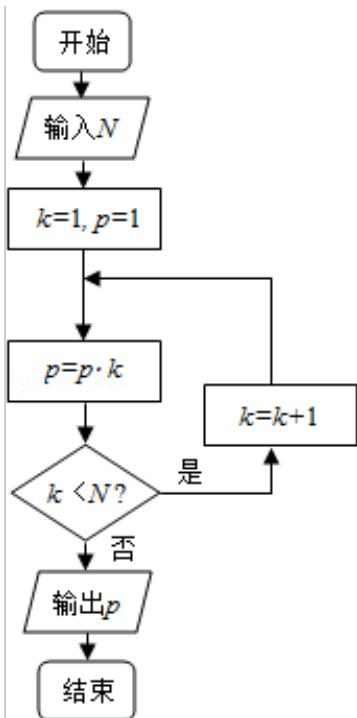

<!-- question-source:start -->
5. （5 分）执行如图的程序框图，如果输入的 N 是 6，那么输出的 p 是（）

A. 120 B. 720 C. 1440 D. 5040
<!-- question-source:end -->

![[高中/真题/按年份分类/2011/2011年全国统一高考数学试卷_文科__新课标__含解析版_/选择题/题目/answers/Q00025144A1.md]]
