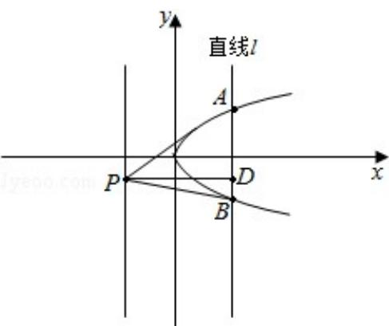

> [!faq]- 2011年全国统一高考数学试卷（文科）（新课标）（含解析版）解析
>
> > [!success]- **【答案】** C
>
> > [!note]- **【分析】**
> > 首先设抛物线的解析式 $y^{2}=2px$ (p>0)，写出次抛物线的焦点、对称轴以及
>
> > [!note]- **【解析】**
> > 解：设抛物线的解析式为 $y^{2}=2px$ （p>0），
> >
> > 则焦点为 $F\left(\frac{p}{2},0\right)$ ，对称轴为 $\mathbf{x}$ 轴，准线为 $x = -\frac{p}{2}$
> >
> > ∵直线Ⅰ经过抛物线的焦点，A、B是Ⅰ与C的交点，
> >
> > 又∵AB⊥x轴
> >
> > $\therefore |AB|=2p=12$
> >
> > $$
> > \therefore p = 6
> > $$
> >
> > 又∵点P在准线上
> >
> > $$
> > \therefore D P = \left(\frac {p}{2} + \left| - \frac {p}{2} \right|\right) = p = 6
> > $$
> >
> > $$
> > \therefore S _ {\triangle A B P} = \frac {1}{2} (D P \bullet A B) = \frac {1}{2} \times 6 \times 1 2 = 3 6
> > $$
> >
> > 故选：C.
> >
> > 
> >
> > 【点评】本题主要考查抛物线焦点、对称轴、准线以及焦点弦的特点；关于直线和圆锥曲线的关系问题一般采取数形结合法.
