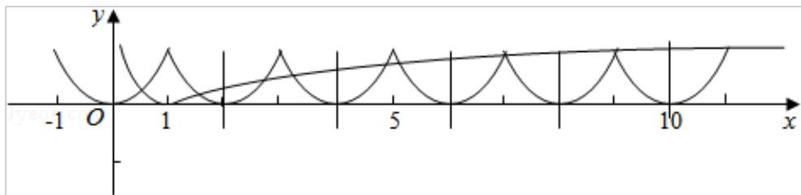

> [!faq]- 2011年全国统一高考数学试卷（文科）（新课标）（含解析版）解析
>
> > [!success]- **【答案】** A
>
> > [!note]- **【分析】**
> > 根据对数函数的性质与绝对值的非负性质, 作出两个函数图象, 再通过计
>
> > [!note]- **【解析】**
> > 分析】根据对数函数的性质与绝对值的非负性质, 作出两个函数图象, 再通过计
> >
> > 算函数值估算即可.
> >
> > 【
> > 解答】解：作出两个函数的图象如上
> >
> > ∵函数 y=f（x）的周期为 2，在[-1，0]上为减函数，在[0，1]上为增函数
> >
> > ∴函数 y=f（x）在区间[0，10]上有 5 次周期性变化，
> >
> > 在[0，1]、[2，3]、[4，5]、[6，7]、[8，9]上为增函数，
> >
> > 在[1，2]、[3，4]、[5，6]、[7，8]、[9，10]上为减函数，
> >
> > 且函数在每个单调区间的取值都为[0，1]，
> >
> > 再看函数 $y = |\lg x|$ ，在区间（0，1]上为减函数，在区间[1，+∞）上为增函数，
> >
> > 且当 x=1 时 y=0；x=10 时 y=1，
> >
> > 再结合两个函数的草图，可得两图象的交点一共有10个，
> >
> > 
> >
> > 故选：A.
> >
> > 【点评】本题着重考查了基本初等函数的图象作法，以及函数图象的周期性，属于
> >
> > 基本题.
> >
> > ## 二、填空题（共4小题，每小题5分，满分20分）
