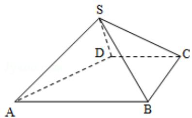

<!-- question-source:start -->
19.（12分）如图，四棱锥S-ABCD中，AB∥CD，BC⊥CD，侧面SAB为等边三角形，

AB=BC=2, CD=SD=1.

（Ⅰ）证明：SD⊥平面 SAB；

(II) 求 AB 与平面 SBC 所成的角的大小.

<!-- question-source:end -->

![[高中/真题/按年份分类/2011/2011年全国统一高考数学试卷_理科__大纲版__含解析版_/填空题/题目/answers/Q00024587A1.md]]
