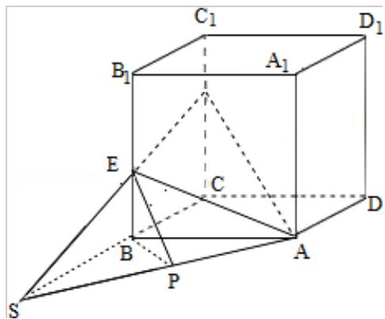

> [!faq]- 2011年全国统一高考数学试卷（理科）（大纲版）（含解析版）解析
>
> > [!success]- **【答案】** 为： $\frac{\sqrt{2}}{3}$  【点评】本题是基础题, 考查二面角的平面角的正切值的求法, 解题的关键是能够 作出二面角的棱，作出二面角的平面角，考查计算能力，逻辑推理能力. ##
>
> > [!note]- **【分析】**
> > 由题意画出正方体的图形，延长 CB、FE 交点为 S 连接 AS，过 B 作 BP⊥AS
>
> > [!note]- **【解析】**
> > 分析】由题意画出正方体的图形，延长 CB、FE 交点为 S 连接 AS，过 B 作 BP⊥AS
> >
> > 连接 PE, 所以面 AEF 与面 ABC 所成的二面角就是: $\angle BPE$ , 求出 BP 与正方体的
> >
> > 棱长的关系，然后求出面 AEF 与面 ABC 所成的二面角的正切值.
> >
> > 【
> > 解答】解：由题意画出图形如图：
> >
> > 因为 E、F 分别在正方体 ABCD - A₁B₁C₁D₁ 的棱 BB₁、CC₁ 上，且 B₁E = 2EB，CF = 2FC₁，
> >
> > 延长 CB、FE 交点为 S 连接 AS，过 B 作 BP⊥AS 连接 PE，所以面 AEF 与面 ABC 所成
> >
> > 的二面角就是 $\angle BPE$ ，因为 $B_{1}E=2EB$ ， $CF=2FC_{1}$ ，
> >
> > 所以 BE: CF=1:2
> >
> > 所以 SB: SC=1: 2,
> >
> > 设正方体的棱长为：a，所以 $AS=\sqrt{2}a$ ， $BP=\frac{\sqrt{2}}{2}a$ ， $BE=\frac{a}{3}$ ，在 RT△PBE 中， $\tan\angle EPB=$
> >
> > $$
> > \frac {\mathrm{BE}}{\mathrm{PB}} = \frac {\frac {a}{3}}{\frac {\sqrt {2}}{2} a} = \frac {\sqrt {2}}{3},
> > $$
> >
> > 故
> > 答案为： $\frac{\sqrt{2}}{3}$
> >
> > 
> >
> > 【点评】本题是基础题, 考查二面角的平面角的正切值的求法, 解题的关键是能够
> >
> > 作出二面角的棱，作出二面角的平面角，考查计算能力，逻辑推理能力.
> >
> > ##
