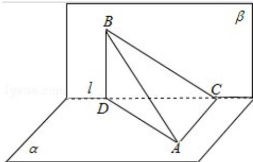

> [!faq]- 2011年全国统一高考数学试卷（理科）（大纲版）（含解析版）解析
>
> > [!success]- **【答案】** C
>
> > [!note]- **【分析】**
> > 画出图形，由题意通过等体积法，求出三棱锥的体积，然后求出 D 到平面 ABC 的距离.
>
> > [!note]- **【解析】**
> > 分析】画出图形，由题意通过等体积法，求出三棱锥的体积，然后求出 D 到平面 ABC 的距离.
> >
> > 【
> > 解答】解：由题意画出图形如图：
> >
> > 直二面角 $\alpha - I - \beta$ ，点 $A \in \alpha$ ，AC⊥I，C 为垂足， $B \in \beta$ ，BD⊥I，D 为垂足，
> >
> > 若 $AB = 2$ ， $\mathrm{AC} = \mathrm{BD} = 1$ ，则D到平面ABC的距离转化为三棱锥D-ABC的高为h，
> >
> > 所以 $AD=\sqrt{3}$ ，CD= $\sqrt{2}$ ，BC= $\sqrt{3}$
> >
> > 由 $V_{B-ACD}=V_{D-ABC}$ 可知 $\frac{1}{3}\times\frac{1}{2}AC\cdot CD\cdot BD=\frac{1}{3}\times\frac{1}{2}AC\cdot BC\cdot h$
> >
> > 所以， $h=\frac{\sqrt{6}}{3}$
> >
> > 
> >
> > 故选C.
> >
> > 【点评】本题是基础题, 考查点到平面的距离, 考查转化思想的应用, 等体积法是
> > 求解点到平面距离的基本方法之一, 考查计算能力.
