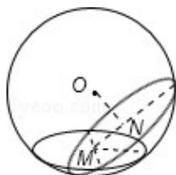

> [!faq]- 2011年全国统一高考数学试卷（理科）（大纲版）（含解析版）解析
>
> > [!success]- **【答案】** D
>
> > [!note]- **【分析】**
> > 先求出圆 M 的半径，然后根据勾股定理求出求出 OM 的长，找出二面角的平面角，从而求出 ON 的长，最后利用垂径定理即可求出圆 N 的半径，从而求出面积.
>
> > [!note]- **【解析】**
> > 解：∵圆 M 的面积为 $4\pi$
> >
> > ∴圆 M 的半径为 2
> >
> > 根据勾股定理可知 $OM = 2\sqrt{3}$
> >
> > ∵过圆心 M 且与 $\alpha$ 成 $60^{\circ}$ 二面角的平面 $\beta$ 截该球面得圆 N
> >
> > $\therefore \angle OMN = 30^{\circ}$ ，在直角三角形OMN中， $ON = \sqrt{3}$
> >
> > ∴圆N的半径为 $\sqrt{13}$
> >
> > 则圆的面积为 $13\pi$
> >
> > 故选：D.
> >
> > 
> >
> > 【点评】本题主要考查了二面角的平面角, 以及解三角形知识, 同时考查空间想象能力,
