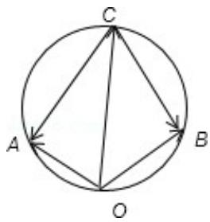

> [!faq]- 2011年全国统一高考数学试卷（理科）（大纲版）（含解析版）解析
>
> > [!success]- **【答案】** A
>
> > [!note]- **【分析】**
> > 利用向量的数量积求出 $\vec{a}$ ， $\vec{b}$ 的夹角；利用向量的运算法则作出图；结合
>
> > [!note]- **【解析】**
> > 分析】利用向量的数量积求出 $\vec{a}$ ， $\vec{b}$ 的夹角；利用向量的运算法则作出图；结合
> >
> > 图，判断出四点共圆；利用正弦定理求出外接圆的直径，求出 $|\vec{c}|$ 最大值.
> >
> > 【
> > 解答】解：∵ $\left|\vec{a}\right|=\left|\vec{b}\right|=1,\quad\vec{a}\cdot\vec{b}=-\frac{1}{2}$
> >
> > ∴ $\vec{a}$ ， $\vec{b}$ 的夹角为 $120^{\circ}$ ，
> >
> > $$
> > \overrightarrow {O A} = \overrightarrow {a}, \overrightarrow {O B} = \overrightarrow {b}, \overrightarrow {O C} = \overrightarrow {c} \text {则} \overrightarrow {C A} = \overrightarrow {a} - \overrightarrow {c}; \overrightarrow {C B} = \overrightarrow {b} - \overrightarrow {c}
> > $$
> >
> > 如图所示
> >
> > 则 $\angle AOB = 120^{\circ}$ ; $\angle ACB = 60^{\circ}$
> >
> > $$
> > \therefore \angle A O B + \angle A C B = 1 8 0 ^ {\circ}
> > $$
> >
> > $\therefore A, O, B, C$ 四点共圆
> >
> > $$
> > \because \overrightarrow {A B} = \overrightarrow {b} - \overrightarrow {a}
> > $$
> >
> > $$
> > \therefore \overrightarrow {A B} ^ {2} = \overrightarrow {b} ^ {2} - 2 \overrightarrow {a} \cdot \overrightarrow {b} + \overrightarrow {a} ^ {2} = 3
> > $$
> >
> > $$
> > \therefore A B = \sqrt {3}
> > $$
> >
> > 由三角形的正弦定理得外接圆的直径 $2R = \frac{AB}{\sin\angle ACB} = 2$
> >
> > 当 OC 为直径时，模最大，最大为 2
> >
> > 故选：A.
> >
> > 
> >
> > 【点评】本题考查向量的数量积公式、向量的运算法则、四点共圆的判断定理、三
> >
> > 角形的正弦定理.
> >
> > 二、填空题：本大题共4小题，每小题5分，共20分.把
> > 答案填在题中横线上.(注
> >
> > 意：在试题卷上作答无效）
