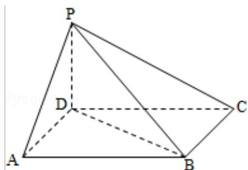

<!-- question-source:start -->
18．（12分）如图，四棱锥P-ABCD中，底面ABCD为平行四边形，

$\angle DAB=60^{\circ}$ ，AB=2AD，PD⊥底面ABCD.

（Ⅰ）证明：PA⊥BD；

（II）若 PD=AD，求二面角 A-PB-C 的余弦值.

<!-- question-source:end -->

![[高中/真题/按年份分类/2011/2011年全国统一高考数学试卷_理科__新课标__含解析版_/解答题/题目/answers/Q00024447A1.md]]
