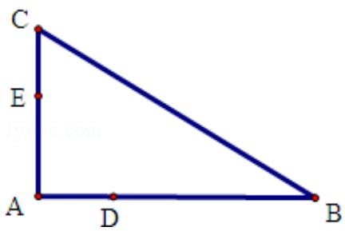

<!-- question-source:start -->
22. (10 分) 如图, D, E 分别为 $\triangle ABC$ 的边 $AB$ , $AC$ 上的点, 且不与 $\triangle ABC$ 的顶点重合. 已知 $AE$ 的长为 $m$ , $AC$ 的长为 $n$ , $AD$ , $AB$ 的长是关于 $x$ 的方程 $x^{2}-14x+mn=0$ 的两个根.

（Ⅰ）证明：C，B，D，E四点共圆；

（II）若 $\angle A = 90^{\circ}$ ，且 $m = 4$ ， $n = 6$ ，求C，B，D，E所在圆的半径.

<!-- question-source:end -->

![[高中/真题/按年份分类/2011/2011年全国统一高考数学试卷_理科__新课标__含解析版_/解答题/题目/answers/Q00025508A1.md]]
