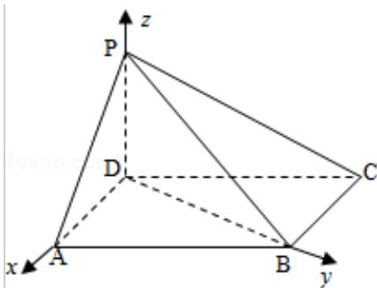

> [!faq]- 2011年全国统一高考数学试卷（理科）（新课标）（含解析版）解析
>
> > [!success]- **【答案】** 详见解析
>
> > [!note]- **【分析】**
> > （Ⅰ）因为 $\angle DAB=60^{\circ}, AB=2AD$ ，由余弦定理得 $BD=\sqrt{3}AD$ ，利用勾股定理证
>
> > [!note]- **【解析】**
> > （Ⅰ）证明：因为 $\angle DAB=60^{\circ}$ ，AB=2AD，由余弦定理得 $BD=\sqrt{3}AD$ ，
> >
> > 从而 $BD^{2}+AD^{2}=AB^{2}$ ，故 $BD\perp AD$
> >
> > 又 PD⊥底面 ABCD，可得 BD⊥PD
> >
> > 所以 BD⊥平面 PAD. 故 PA⊥BD
> >
> > （Ⅱ）如图，以 D 为坐标原点，AD 的长为单位长，
> >
> > 射线 DA 为 x 轴的正半轴建立空间直角坐标系 D - xyz，则
> >
> > A (1, 0, 0), B (0, $\sqrt{3}$ , 0), C (-1, $\sqrt{3}$ , 0), P (0, 0, 1).
> >
> > $$
> > \overrightarrow {\mathrm{AB}} = (- 1, \sqrt {3}, 0), \overrightarrow {\mathrm{PB}} = (0, \sqrt {3}, - 1), \overrightarrow {\mathrm{BC}} = (- 1, 0, 0)
> > $$
> >
> > 设平面PAB的法向量为 $\vec{\mathbf{n}} = (x, y, z)$ ，则 $\left\{ \begin{array}{l} \vec{\mathbf{n}} \cdot \overrightarrow{\mathbf{AB}} = 0 \\ \vec{\mathbf{n}} \cdot \overrightarrow{\mathbf{PB}} = 0 \end{array} \right.$
> >
> > 即 $\left\{\begin{aligned}-x+\sqrt{3}y&=0\\ \sqrt{3}y-z&=0\end{aligned}\right.$
> >
> > 因此可取 $\vec{\mathbf{n}} = (\sqrt{3}, 1, \sqrt{3})$
> >
> > 设平面PBC的法向量为 $\vec{\pi} = (x, y, z)$ ，则 $\left\{ \begin{array}{l} \vec{m} \cdot \overrightarrow{cB} = 0 \\ \vec{m} \cdot \overrightarrow{PB} = 0 \end{array} \right.$ ，
> >
> > 即： $\left\{ \begin{array}{l}x = 0\\ \sqrt{3} y - z = 0 \end{array} \right.$
> >
> > 可取 $\vec{\pi} = (0, 1, \sqrt{3})$ ， $\cos < \vec{m}, \vec{n} > = \frac{\vec{m} \cdot \vec{n}}{|\vec{m}| |\vec{n}|} = \frac{4}{2\sqrt{7}}$
> >
> > 故二面角 A-PB-C 的余弦值为： $\frac{2\sqrt{7}}{7}$ .
> >
> > 
> >
> > 【点评】此题是个中档题. 考查线面垂直的性质定理和判定定理, 以及应用空间向量求空间角问题, 查了同学们观察、推理以及创造性地分析问题、解决问题能力.
