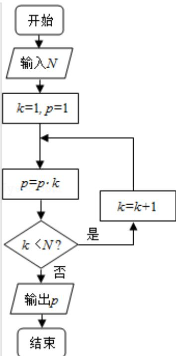

<!-- question-source:start -->
3. （5分）执行如图的程序框图，如果输入的N是6，那么输出的p是（）

A. 120 B. 720 C. 1440 D. 5040
<!-- question-source:end -->

![[高中/真题/按年份分类/2011/2011年全国统一高考数学试卷_理科__新课标__含解析版_/选择题/题目/answers/Q00024432A1.md]]
