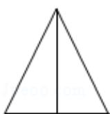
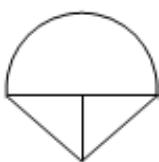
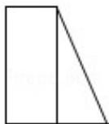
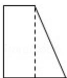
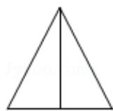

<!-- question-source:start -->
6. (5 分) 在一个几何体的三视图中, 正视图和俯视图如图所示, 则相应的侧视图可以为 ( )

  
(正视图)

  
(俯视图)

A.

C.

D.

<!-- question-source:end -->

![[高中/真题/按年份分类/2011/2011年全国统一高考数学试卷_理科__新课标__含解析版_/选择题/题目/answers/Q00024435A1.md]]
