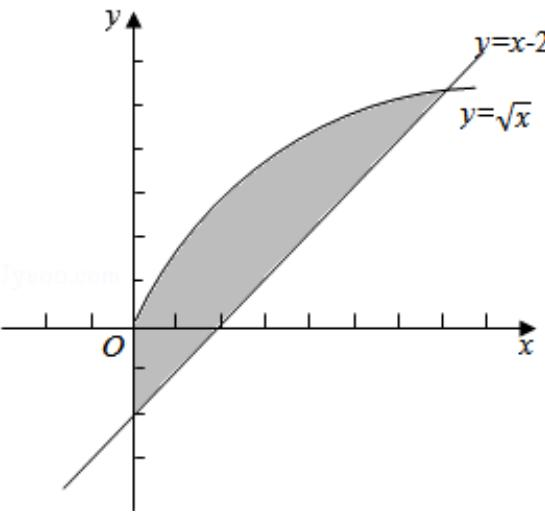

> [!faq]- 2011年全国统一高考数学试卷（理科）（新课标）（含解析版）解析
>
> > [!success]- **【答案】** C
>
> > [!note]- **【分析】**
> > 利用定积分知识求解该区域面积是解决本题的关键，要确定出曲线 $y=\sqrt{x}$ ，直线 y=x-2 的交点，确定出积分区间和被积函数，利用导数和积分的关系完成本题的求解.
>
> > [!note]- **【解析】**
> > 解：联立方程 $\left\{\begin{aligned}y&=\sqrt{x}\\ y&=x-2\end{aligned}\right.$ 得到两曲线的交点（4，2），
> >
> > 因此曲线 $y=\sqrt{x}$ ，直线 y=x-2 及 y 轴所围成的图形的面积为：
> >
> > $S=\int\limits_{0}^{4}\left(\sqrt{x}-x+2\right)dx=\left(\frac{2}{3}x^{\frac{3}{2}}-\frac{1}{2}x^{2}+2x\right)\bigg|_{0}^{4}=\frac{16}{3}.$ 故选C.
> >
> > 
> >
> > 【点评】本题考查曲边图形面积的计算问题，考查学生分析问题解决问题的能力和意识，考查学生的转化与化归能力和运算能力，考查学生对定积分与导数的联系的认识，求定积分关键要找准被积函数的原函数，属于定积分的简单应用问题.
