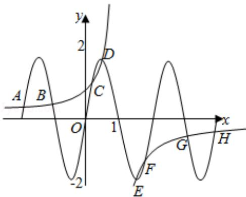

> [!faq]- 2011年全国统一高考数学试卷（理科）（新课标）（含解析版）解析
>
> > [!success]- **【答案】** A
>
> > [!note]- **【分析】**
> > 函数 $y_{1}=\frac{1}{1-x}$ 与 $y_{2}=2\sin\pi x$ 的图象有公共的对称中心 (1,0)，作出两个函数的图象，利用数形结合思想能求出结果.
>
> > [!note]- **【解析】**
> > 分析】函数 $y_{1}=\frac{1}{1-x}$ 与 $y_{2}=2\sin\pi x$ 的图象有公共的对称中心 (1,0)，作出两个函数的图象，利用数形结合思想能求出结果.
> >
> > 【
> > 解答】解：函数 $y_{1}=\frac{1}{1-x}$ ,
> >
> > $y_{2}=2\sin\pi x$ 的图象有公共的对称中心（1，0），
> >
> > 作出两个函数的图象，如图，
> >
> > 当 $1 < x \leq 4$ 时， $y_{1} < 0$
> >
> > 而函数 $y_{2}$ 在 $(1, 4)$ 上出现 1.5 个周期的图象，
> >
> > 在 $(1, \frac{3}{2})$ 和 $(\frac{5}{2}, \frac{7}{2})$ 上是减函数；
> >
> > 在 $\left(\frac{3}{2},\frac{5}{2}\right)$ 和 $\left(\frac{7}{2},4\right)$ 上是增函数.
> >
> > ∴函数 $y_{1}$ 在（1，4）上函数值为负数，
> >
> > 且与 $\gamma_{2}$ 的图象有四个交点E、F、G、H
> >
> > 相应地， $y_{1}$ 在 $(-2, 1)$ 上函数值为正数，
> >
> > 且与 $y_{2}$ 的图象有四个交点 A、B、C、D
> >
> > 且： $x_{A}+x_{H}=x_{B}+x_{G}=x_{C}+x_{F}=x_{D}+x_{E}=2$
> >
> > 故所求的横坐标之和为 8.
> >
> > 故选：A.
> >
> > 
> >
> > 【点评】本题考查两个函数的图象的交点的横坐标之和的求法, 是基础题, 解题时
> >
> > 要认真审题，注意数形结合思想的合理运用.
> >
> > ## 二、填空题（共4小题，每小题5分，满分20分）
