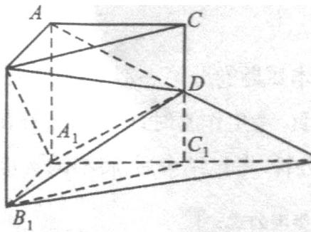
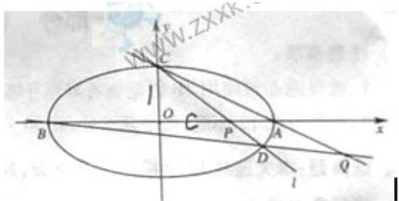

<!-- question-source:start -->
17. (本小题共 12 分)

本着健康、低碳的生活理念，租自行车骑游的人越来越多。某自行车租车点的收费标准是每车每次租不超过两小时免费，超过两小时的收费标准为2元（不足1小时的部分按1小时计算）。有人独立来该租车点则车骑游。各租一车一次。设甲、乙不超过两小时还车的概率分别为 $\frac{1}{4},\frac{1}{2}$ ；两小时以上且不超过三小时还车的概率分别为 $\frac{1}{2},\frac{1}{4}$ ；两人租车时间都不会超过四小时。

（Ⅰ）分别求出甲、乙在三小时以上且不超过四小时还车的概率；

（Ⅱ）求甲、乙两人所付的租车费用之和小于6元的概率。

## 18.（本小题共12分）

已知函数 $f(x) = \sin \left(x + \frac{7\pi}{4}\right) + \cos \left(x - \frac{3\pi}{4}\right), x \in R$

（Ⅰ）求 $f(x)$ 的最小正周期和最小值；

（Ⅱ）已知 $\cos(\beta-\alpha)=\frac{4}{5},\cos(\beta-\partial)=\frac{4}{5}.0<\alpha<\beta\leq\frac{\pi}{2}$ ，求证： $\left[f(\beta)\right]^{2}-2=0$

## 19. (本小题共 12 分)

如图，在直三棱柱 ABC—A₁B₁C₁ 中，∠BAC=90°，AB=AC=A A₁=1，延长 A₁C₁ 至点 P，使 C₁P = A₁C₁，连结 AP

交棱 $C_{1}$ 于点 D.

(I)求证： $PB_{1}\|BD A_{1};$

(Ⅱ)求二面角 A- $A_{1}D-B$ 的平面角的余弦值。

## 20. (本小题共 12 分)

已知 $\{a_{n}\}$ 是以 a 为首项，q 为公比的等比数列， $S_{n}$ 为它的前 n 项和。

(I)当 $S_{1}, S_{3}, S_{4}$ 成等差数列时，求 q 的值；

(Ⅱ)当 $S_{m}$ ， $S_{n}$ ， $S_{i}$ 成等差数列时，求证：对任意自然数 $k, a_{m+i}, a_{n+i}, a_{1+i}$ 也成等差数列。

## 21. (本小题共 12 分)

过点 $C(0,1)$ 的椭圆 $\frac{x^2}{a^2} +\frac{y^2}{b^2} = 1(a > b > 0)$ 的离心率为 $\frac{\sqrt{3}}{2}$ ，椭圆与 $x$ 轴交于两点 $A(A,0)$ 、 $B(-a,0)$ ，过点 $C$ 的直线 $l$ 与椭圆右焦点交于另一点 $D$ ，并与 $x$ 轴交于点 $P$ ，直线 $AC$ 与直线 $BD$ 交于点 $Q$ 。

(I) 当直线 l 过椭圆右焦点时，求线段 CD 的长；

（Ⅱ）当点 P 异于点 B 时，求证： $OP \cdot OQ$ 为定值。

<!-- question-source:end -->

![[高中/真题/按年份分类/2011/2011年四川高考文科数学试卷_word版_和答案/解答题/题目/answers/Q00026512A1.md]]
