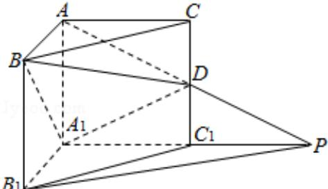

<!-- question-source:start -->
19. (12 分) (2011·四川) 如图, 在直三棱柱 ABC - A₁B₁C₁ 中, ∠BAC=90°, AB=AC=AA₁=1, 延长 A₁C₁ 至点 P, 使 C₁P=A₁C₁, 连接 AP 交棱 CC₁ 于点 D.

(Ⅰ) 求证: $PB_{1}\parallel$ 平面 $BDA_{1}$ ;

（Ⅱ）求二面角 A - A₁D - B 的平面角的余弦值.

【考点】直线与平面平行的判定；直线与平面平行的性质.

【专题】计算题；证明题.

【
<!-- question-source:end -->

![[高中/真题/按年份分类/2011/2011年四川高考文科数学试卷_word版_和答案/解答题/题目/answers/Q00026517A1.md]]
