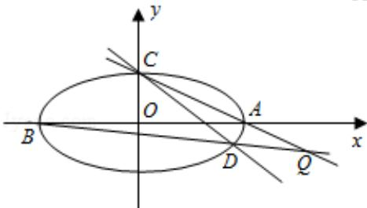

<!-- question-source:start -->
21. (12 分) (2011·四川) 过点 C(0,1) 的椭圆 $\frac{x^{2}}{a^{2}} + \frac{y^{2}}{b^{2}} = 1 (a > b > 0)$ 的离心率为 $\frac{\sqrt{3}}{2}$ ，椭圆与 x 轴交于两点 A(a,0)、B(-a,0)，过点 C 的直线 l 与椭圆交于另一点 D，并与 x 轴交于点 P，直线 AC 与直线 BD 交于点 Q.

(I) 当直线1过椭圆右焦点时，求线段CD的长；

（Ⅱ）当点P异于点B时，求证： $\overrightarrow{OP}\cdot\overrightarrow{OQ}$ 为定值.

【考点】直线与圆锥曲线的综合问题；椭圆的应用.

【专题】计算题；证明题；综合题；压轴题；数形结合.

【
<!-- question-source:end -->

![[高中/真题/按年份分类/2011/2011年四川高考文科数学试卷_word版_和答案/解答题/题目/answers/Q00026519A1.md]]
