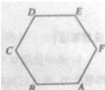

<!-- question-source:start -->
7.如图，正六边形 ABCDEF 中 $BA + CD + EF =$ (A) 0 (B) BE
(C) AD (D) CF

<!-- question-source:end -->

![[高中/真题/按年份分类/2011/2011年四川高考文科数学试卷_word版_和答案/选择题/题目/answers/Q00026503A1.md]]
