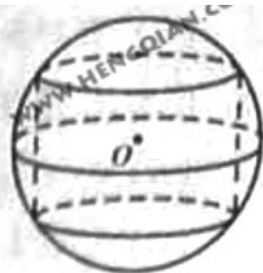

<!-- question-source:start -->
16. 函数 $f(x)$ 的定义域为 $A$ , 若 $x_1, x_2 \in A$ , 且 $f(x_1) = f(x_2)$ 时总有 $x_1 = x_2$ , 则称 $f(x)$ 为单函数. 例如 $f(x) = 2x + 1 (x \in R)$ 是单函数, 下列命题:

① 函数 $f(x)^{2}=x^{2}(x\in R)$ 是单函数；

② 函数 $f(x)=2^{x}(x\in R)$ 是单函数，

③ 若 $f(x)$ 为单函数， $x_{1}, x_{2} \in A$ 且 $x_{1} \neq x_{2}$ ，则 $f(x_{1}) \neq f(x_{2})$ ;

④ 在定义域上具有单调性的函数一定是单函数

其中的真命题是\_\_\_\_（写出所有真命题的编号）

##
三、解答题：本大题共6小题，共74分。
<!-- question-source:end -->

![[高中/真题/按年份分类/2011/2011年四川高考文科数学试卷_word版_和答案/选择题/题目/answers/Q00027993A1.md]]
