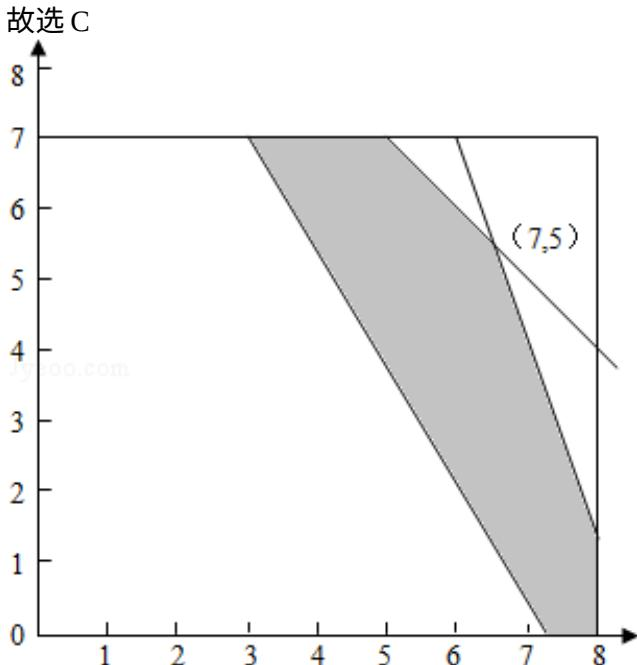

> [!faq]- 2011年四川高考文科数学试卷(word版)和答案解析
>
> > [!success]- **【答案】** . 【
>
> > [!note]- **【分析】**
> > 我们设派 x 辆甲卡车，y 辆乙卡车，利润为 z，根据题意中运输公司有 12 名驾驶员和 19 名工人，有 8 辆载重量为 10 吨的甲型卡车和 7 辆载重量为 6 吨的乙型卡车，某天需送往 A 地至少 72 吨的货物，派用的每辆车需载满且只能送一次，派用的每辆甲型卡车需配 2 名工人，运送一次可得利润 450 元；派用的每辆乙型卡需配1名工人；每送一次可得利润350元，我们易构造出x，y满足的约束条件，及目标函数，画出满足条件的平面区域，利用角点法即可得到
>
> > [!note]- **【解析】**
> > 解：设派 x 辆甲卡车，y 辆乙卡车，利润为 z，
> >
> > 由题意得： $z=450x+350y$
> >
> > 由题意得 x，y 满足下列条件：
> >
> > $$
> > \left\{ \begin{array}{l} 0 \leqslant x \leqslant 8 \\ 0 \leqslant y \leqslant 7 \\ 0 <   x + y \leqslant 1 2 \\ 1 0 x + 6 y \geqslant 7 2 \\ 0 <   2 x + y \leqslant 1 9 \\ x \in Z, y \in Z \end{array} \right.
> > $$
> >
> > 上述条件作出可行域，如图所示：
> >
> > 由图可知，当 x=7，y=5 时， $450x+350y$ 有最大值 4900
> >
> > 
> >
> > 【点评】在解决线性规划的应用题时, 其步骤为: ①
