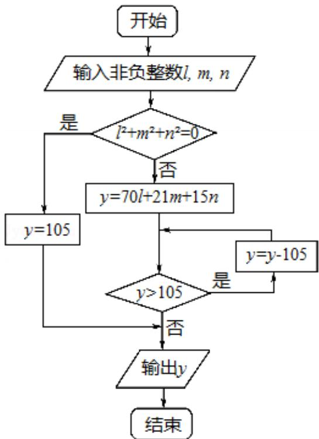

<!-- question-source:start -->
13. (3 分) (2011·山东) 执行如图所示的程序框图, 输入 l=2, m=3, n=5, 则输出的 y 的值是 \_\_\_\_.

<!-- question-source:end -->

![[高中/真题/按年份分类/2011/2011年山东省高考数学试卷_理科_word版试卷及解析/填空题/题目/answers/Q00023087A1.md]]
