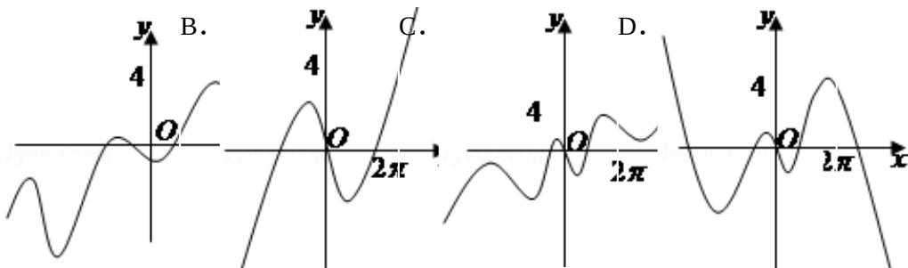

<!-- question-source:start -->
9. (3分) (2011·山东) 函数 $y = \frac{x}{2} - 2\sin x$ 的图象大致是（）

A.

考点: 函数的图象.

专题：三角函数的图像与性质.
<!-- question-source:end -->

![[高中/真题/按年份分类/2011/2011年山东省高考数学试卷_理科_word版试卷及解析/选择题/题目/answers/Q00028007A1.md]]
