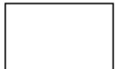
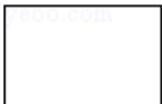

<!-- question-source:start -->
11. （3分）（2011·山东）如图是长和宽分别相等的两个矩形．给定下列三个命题：

① 存在三棱柱，其正（主）视图、俯视图如图；

② 存在四棱柱，其正（主）视图、俯视图如图；

③ 存在圆柱，其正（主）视图、俯视图如图.

其中真命题的个数是（）

正（主）视图

俯视图

A. 3 B. 2 C. 1 D. 0

考点：简单空间图形的三视图.

专题： 立体几何.
<!-- question-source:end -->

![[高中/真题/按年份分类/2011/2011年山东省高考数学试卷_理科_word版试卷及解析/选择题/题目/answers/Q00028009A1.md]]
