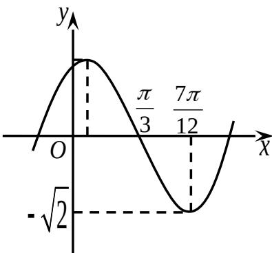

<!-- question-source:start -->
9. 函数 $f(x)=A\sin(\omega x+\varphi)$ (A, $\omega$ , $\varphi$ 是常数,

$A>0,\omega>0$ 的部分图象如图所示，则 $f(0)$ 的值是 ▲.
<!-- question-source:end -->

![[高中/真题/按年份分类/2011/2011年江苏高考数学试题及答案/填空题/题目/answers/Q00026775A1.md]]
