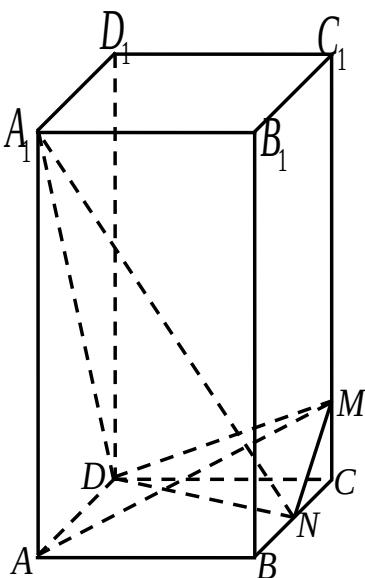

<!-- question-source:start -->
23. （本小题满分 10 分）

设整数 $n \geq 4$ ， $P(a, b)$ 是平面直角坐标系 $xOy$ 中的点，其中 $a, b \in \{1, 2, 3, \ldots, n\}$ ，

$a > b$

(1) 记 $A_{n}$ 为满足 $a - b = 3$ 的点 $P$ 的个数，求 $A_{n}$ ；

(2) 记 $B_{n}$ 为满足 $\frac{1}{3} (a - b)$ 是整数的点 $P$ 的个数，求 $B_{n}$ .

## 数学Ⅰ试题参考
<!-- question-source:end -->

![[高中/真题/按年份分类/2011/2011年江苏高考数学试题及答案/解答题/题目/answers/Q00026784A1.md]]
