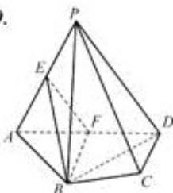

<!-- question-source:start -->
16. 本小题主要考查直线与平面、平面与平面的位置关系,考查空间想象能力和推理论证能力. 满分 14 分.

证明:(1)在 $\triangle PAD$ 中, 因为E, F分别为AP, AD的中点, 所以EF//PD.
又因为 EF∉平面 PCD, PD⊂平面 PCD,
所以直线 EF//平面 PCD.

(2) 连结 BD. 因为 AB = AD, $\angle BAD = 60^{\circ}$ ，所以 $\triangle ABD$ 为正三角形. 因为 F 是 AD 的中点，所以 $BF \perp AD$ . 因为平面 $PAD \perp$ 平面 ABCD, $BF \subset$ 平面 ABCD, 平面 $PAD \cap$ 平面 ABCD = AD, 所以 $BF \perp$ 平面 PAD. 又因为 $BF \subset$ 平面 BEF, 所以平面 BEF $\perp$ 平面 PAD.

  
(第16题)
<!-- question-source:end -->

![[高中/真题/按年份分类/2011/2011年江苏高考数学试题及答案/解答题/题目/answers/Q00026785A1.md]]
